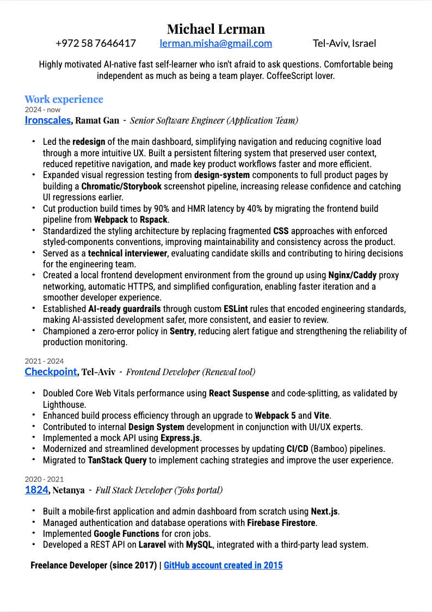

  

<h2 align="center">Developer tools that make large codebases easier to understand and change.</h2>

  Senior software engineer building language servers, editor integrations, and observable agent workflows in Rust and TypeScript.
   
  Open to opportunities focused on developer infrastructure, editors, and AI tooling.

  <a href="https://subagentura.tech"><strong>Portfolio</strong></a>
  ·
  <a href="./output/pdf/michael-lerman-cv.pdf"><strong>CV</strong></a>
  ·
  <a href="mailto:hello@subagentura.tech"><strong>Contact</strong></a>
  ·
  <a href="https://github.com/lmn451?tab=repositories"><strong>All projects</strong></a>

## Featured Work

### CSS Variables Tooling

**Project-wide CSS custom-property intelligence, from a native language server to editor integrations.**

I maintain a connected toolchain that brings completion, hover, navigation, rename, diagnostics, and color tools to CSS, HTML, JavaScript/TypeScript, Vue, Svelte, Astro, and more.

- Native Rust language server with cross-platform binaries and no Node.js runtime requirement
- Zed and VS Code integrations that select and configure the right server automatically
- TypeScript/npm implementation for portable and fallback environments

  <a href="https://zed.dev/extensions/css-variables"><strong>Install for Zed »</strong></a>
  ·
  <a href="https://github.com/lmn451/css-lsp-rust"><strong>Rust LSP</strong></a>
  ·
  <a href="https://www.npmjs.com/package/css-variable-lsp"><strong>npm</strong></a>
  ·
  <a href="https://marketplace.visualstudio.com/items?itemName=miclmn451.css-variables-vscode"><strong>Install for VS Code »</strong></a>

---

### pi-subagentura

**Reusable multi-agent workflows and observable, attachable sub-agents for the Pi coding agent.**

Give the parent agent an outcome and let it build the team. pi-subagentura turns work into saved workflows while keeping child sessions visible and their intermediate results out of the parent context.

- Run sequential, parallel, and pipelined agent workflows in the background
- Watch, attach to, and continue child sessions in tmux or Zellij
- Reuse review, research, migration, and conversion workflows across projects

  <a href="https://subagentura.tech"><strong>View project »</strong></a>
  ·
  <a href="https://www.npmjs.com/package/pi-subagentura"><strong>npm</strong></a>
  ·
  <a href="https://github.com/lmn451/pi-subagentura"><strong>Source</strong></a>

---

### JSX Prop Lookup

**AST-powered React and TypeScript prop analysis exposed through MCP.**

Use code-aware queries to understand component APIs and audit prop usage across an unfamiliar repository before a refactor.

- Find prop usages and component APIs across JavaScript and TypeScript projects
- Recover TypeScript interface information alongside component results
- Audit component instances for missing required props

  <a href="https://www.npmjs.com/package/jsx-prop-lookup-mcp-server"><strong>Install from npm »</strong></a>
  ·
  <a href="https://github.com/lmn451/jsx-prop-lookup-mcp-server"><strong>Source</strong></a>

## More Projects

- **[Git Search for VS Code](https://marketplace.visualstudio.com/items?itemName=lmn451.git-log-s)** — Search commit history, paginate large result sets, and jump directly to remote commits. [Source](https://github.com/lmn451/git-search)
- **[Screencast](https://subagentura.tech/screencast/)** — Chromium extension for screen-recording workflows, recovery, diagnostics, and export. [Source](https://github.com/lmn451/screencast)
- **[Smart Life Webapp](https://smart-life-webapp.pages.dev)** — Installable Vue PWA for controlling Smart Life devices through a region-aware Cloudflare API proxy. [Source](https://github.com/lmn451/smart-life-webapp)

## Get in Touch

Interested in developer tools, editor infrastructure, or agent workflows? Reach me at **[hello@subagentura.tech](mailto:hello@subagentura.tech)**.

  
<strong>CV preview</strong>

  

    
  

