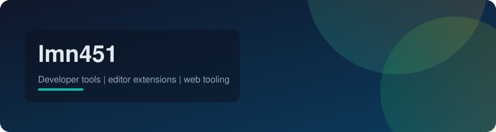

  

<h2 align="center">Developer tooling for editors, CSS, and code archaeology.</h2>

  I build language servers, editor extensions, and web utilities that make complex codebases feel small.
   
  Currently paid to be a Senior Software Engineer.

  

  
  
  
   
  
  
  

## Signature Projects

<table>
  <tr>
    <td width="50%" valign="top">
      <h3>⚛️ JSX Prop Lookup (MCP)</h3>
      
AST-powered analysis for React and TypeScript prop usage across a whole repo.

      

        <a href="https://github.com/lmn451/jsx-prop-lookup-mcp-server"><strong>View Repo »</strong></a>
      

      <ul>
        <li>Codebase-wide prop search and component analysis</li>
        <li>Advanced component queries with AND/OR filters</li>
        <li>TypeScript interface-aware results</li>
      </ul>
    </td>
    <td width="50%" valign="top">
      <h3>🎨 CSS Variable LSP</h3>
      
Language server focused on CSS custom properties with completions, hovers, and diagnostics.

      

        <a href="https://github.com/lmn451/css-lsp"><strong>View Repo</strong></a> | <a href="https://www.npmjs.com/package/css-variable-lsp"><strong>npm »</strong></a>
      

      <ul>
        <li>Workspace indexing across CSS and HTML styles</li>
        <li>Cascade-aware hover resolution</li>
        <li>Diagnostics for undefined variables</li>
      </ul>
    </td>
  </tr>
  <tr>
    <td width="50%" valign="top">
      <h3>⚡ CSS Variables for Zed</h3>
      
Zed extension that runs css-variable-lsp with zero manual setup.

      

        <a href="https://github.com/lmn451/css-variables-zed"><strong>View Repo</strong></a> | <a href="https://zed.dev/extensions/css-variables"><strong>Zed Extension »</strong></a>
      

      <ul>
        <li>Completion, hover, and references for CSS variables</li>
        <li>Works in CSS, JS/TS, Vue, Svelte, and more</li>
        <li>Auto-installs the latest LSP on first run</li>
      </ul>
    </td>
    <td width="50%" valign="top">
      <h3>🔍 Git Search for VS Code</h3>
      
Fast, UI-based git log search to answer who changed what and when.

      

        <a href="https://github.com/lmn451/git-search"><strong>View Repo »</strong></a>
      

      <ul>
        <li>Search commit history without the terminal</li>
        <li>Jump straight to remote commits</li>
        <li>Pagination for large histories</li>
      </ul>
    </td>
  </tr>
  <tr>
    <td width="50%" valign="top">
      <h3>🎥 Screencast Extension</h3>
      
Chromium browser extension for screen recording workflows.

      

        <a href="https://github.com/lmn451/screencast"><strong>View Repo »</strong></a>
      

      <ul>
        <li>Unpacked dev workflow for Chromium browsers</li>
        <li>Clear setup and reload steps for fast iteration</li>
      </ul>
    </td>
    <td width="50%" valign="top">
      <h3>🏠 Smart Life Webapp</h3>
      
PWA to control Smart Life devices with a Cloudflare Pages Functions API proxy.

      

        <a href="https://github.com/lmn451/smart-life-webapp"><strong>View Repo »</strong></a>
      

      <ul>
        <li>Vue 3, Element Plus, and Cloudflare Pages</li>
        <li>Tuya API proxy with region support</li>
      </ul>
    </td>
  </tr>
</table>

